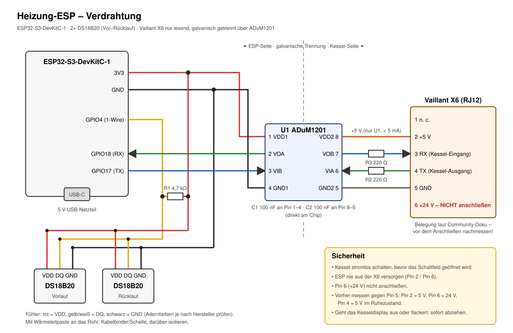

# Heizung-ESP (ESPHome)

ESP32-S3-DevKitC-1 am Heizkessel. Er liefert HeatConductor die **Vorlauf- und
Rücklauftemperatur** über zwei DS18B20-Anlegefühler, auf dem ESP kalibriert.

Kesseldaten über die Vaillant-X6-Diagnoseschnittstelle sind ein eigenes Projekt:
[esphome-vaillant-x6](https://github.com/MYF540/esphome-vaillant-x6).



## Teile

| Bauteil | Anzahl | Hinweis |
|---|---|---|
| ESP32-S3-DevKitC-1 | 1 | Versorgung über USB-C mit eigenem 5-V-Netzteil |
| DS18B20, wasserdichte Ausführung mit Kabel | 2 | Anlegefühler |
| Widerstand 4,7 kΩ (R1) | 1 | 1-Wire-Pull-up; bei Kabel > 10 m: 2,2 kΩ |
| Wärmeleitpaste, Kabelbinder/Rohrschellen, Isolierung | – | Fühlermontage |

## Anschlüsse

| ESP32-S3 | DS18B20 (beide parallel) |
|---|---|
| 3V3 | VDD (meist rot) |
| GND | GND (meist schwarz) |
| GPIO4 | DQ (meist gelb/weiß) + R1 4,7 kΩ nach 3V3 |

## Fühlermontage

- **Vorlauf:** am Vorlaufrohr kurz nach dem Kessel, vor dem ersten Abzweig.
- **Rücklauf:** am Rücklaufrohr kurz vor dem Kessel.
- Fühler mit Wärmeleitpaste längs an das blanke Rohr (Kupfer/Stahl), mit Kabelbinder oder
  Schelle fixieren, darüber isolieren. Anlegefühler messen einige Kelvin träger und
  niedriger als die Wassertemperatur; für Spreizung und Brennerzyklen ist das ausreichend.

## ESPHome Device Builder in Home Assistant

`heizung-esp.yaml` nach `/config/esphome/` kopieren (oder im Builder als neues Gerät
einfügen). Externe Komponenten sind nicht nötig.

Die Zugangsdaten gehören in die Secrets des Builders (oben rechts *Secrets*), Schlüssel
siehe `secrets.yaml.example`.

## Inbetriebnahme

1. `secrets.yaml.example` nach `secrets.yaml` kopieren und ausfüllen (bzw. Secrets im Builder).
2. Erstes Flashen per USB (z. B. ESPHome Builder in Home Assistant oder
   `esphome run heizung-esp.yaml`). Die Platzhalter-Adressen der DS18B20 sind noch leer.
3. Im Log listet der 1-Wire-Bus die gefundenen Adressen (`0x…`). Alternativ in Home Assistant
   den Button *1-Wire Suche* drücken. Einen Fühler kurz in der Hand erwärmen, um Vorlauf und
   Rücklauf zuzuordnen.
4. Adressen unter `substitutions` (`address_flow`, `address_return`) eintragen, erneut flashen.
5. **Fühler kalibrieren** (siehe unten).

## Kalibrierung der Vor- und Rücklauffühler

Die Korrektur passiert **auf dem ESP**: Die Entitäten *Vorlauf* und *Rücklauf* liefern
bereits korrigierte Werte an Home Assistant, HeatConductor und alle anderen Nutzer.

```
korrigiert = roh × Faktor + Offset
```

| Entität | Bedeutung |
|---|---|
| *Vorlauf roh*, *Rücklauf roh* (Diagnose) | unkorrigierter Messwert des DS18B20 |
| *Vorlauf/Rücklauf Kalibrierung Offset* (Konfiguration) | Verschiebung in K, Standard 0 |
| *Vorlauf/Rücklauf Kalibrierung Faktor* (Konfiguration) | Steigung, Standard 1 |

Die Werte stellst du in Home Assistant am Gerät *Heizung* unter *Konfiguration* ein. Sie
werden auf dem ESP gespeichert, überstehen Neustarts und wirken ab der nächsten Messung
(höchstens 15 s), ohne neu zu flashen.

### Zwei-Punkt-Kalibrierung (am genauesten, vor der Montage)

1. Beide Fühler und ein **Referenzthermometer** zusammen in ein isoliertes Gefäß mit Wasser.
2. **Punkt 1** bei etwa 25 °C, **Punkt 2** bei etwa 60 °C: jeweils einige Minuten warten, dann
   Referenz `R` und Rohwert `M` („… roh“) je Fühler notieren.
3. Je Fühler berechnen und eintragen:

   ```
   Faktor = (R2 − R1) / (M2 − M1)
   Offset = R1 − M1 × Faktor
   ```

   Beispiel: M1 = 24,6, R1 = 25,0, M2 = 59,1, R2 = 60,0
   → Faktor = 35,0 / 34,5 = **1,0145** · Offset = 25,0 − 24,6 × 1,0145 = **0,04 K**

   Das Eingabefeld für den Faktor erlaubt drei Nachkommastellen: 1,014 ergibt dann einen
   Offset von 0,06 K (Offset immer mit dem tatsächlich eingetragenen Faktor berechnen).

### Ein-Punkt-Kalibrierung (Offset, auch nach der Montage)

Faktor auf 1 lassen. Bei gleicher Temperatur Referenz und Rohwert vergleichen:
`Offset = Referenz − roh`.

Nach der Montage eignet sich dafür eine längere Brennerpause mit laufender Pumpe: Vor- und
Rücklauf sind dann annähernd gleich warm. Den Rücklauf-Offset so wählen, dass beide Fühler
denselben Wert zeigen.

Hinweis: Anlegefühler messen am Rohr etwas weniger als die Wassertemperatur. Die
Zwei-Punkt-Kalibrierung im Wasserbad korrigiert den Fühler selbst; eine zusätzliche
Montage-Abweichung lässt sich danach über den Offset ausgleichen.

## Einbindung in HeatConductor

*HeatConductor → Konfigurieren → Zentrale Entitäten:*

| Feld | Entität |
|---|---|
| Vorlauftemperatur | `sensor.heizung_vorlauf` (DS18B20, kalibriert) |
| Rücklauftemperatur | `sensor.heizung_rucklauf` (DS18B20, kalibriert) |

Brennerstatus und Vorlauf-Soll des Kessels sind optionale Eingänge. Sie können aus dem
Gasdurchfluss oder aus einer Kesselanbindung wie
[esphome-vaillant-x6](https://github.com/MYF540/esphome-vaillant-x6) stammen.
